# @jagreehal/workflow

Typed async workflows with automatic error inference. Build type-safe workflows with Result types, step caching, resume state, and human-in-the-loop support.

**You've been here before:** You're debugging a production issue at 2am. The error says "Failed to load user data." But *why* did it fail? Was it the database? The cache? The API? TypeScript can't help you - it just sees `unknown` in every catch block.

This library fixes that. Your errors become **first-class citizens** with full type inference, so TypeScript knows exactly what can go wrong before your code even runs.

```bash
npm install @jagreehal/workflow
```

**What you get:**

- **Automatic error inference** - Error types flow from your dependencies. Add a step? The union updates. Remove one? It updates. Zero manual tracking.
- **Built-in reliability** - Retries, timeouts, caching, and circuit breakers when you need them. Not before.
- **Resume & approvals** - Pause workflows for human review, persist state, pick up where you left off.
- **Full visibility** - Event streams, ASCII timelines, Mermaid diagrams. See what ran, what failed, and why.

## Quickstart (60 Seconds)

### 1. Define your operations

Return `ok(value)` or `err(errorCode)` instead of throwing.

```typescript
import { ok, err, type AsyncResult } from '@jagreehal/workflow';

const fetchOrder = async (id: string): AsyncResult<Order, 'ORDER_NOT_FOUND'> =>
  id ? ok({ id, total: 99.99, email: 'user@example.com' }) : err('ORDER_NOT_FOUND');

const chargeCard = async (amount: number): AsyncResult<Payment, 'CARD_DECLINED'> =>
  amount < 10000 ? ok({ id: 'pay_123', amount }) : err('CARD_DECLINED');
```

### 2. Create and run

`createWorkflow` handles the type magic. `step()` unwraps results or exits early on failure.

```typescript
import { createWorkflow } from '@jagreehal/workflow';

const checkout = createWorkflow({ fetchOrder, chargeCard });

const result = await checkout(async (step) => {
  const order = await step(fetchOrder('order_456'));
  const payment = await step(chargeCard(order.total));
  return { order, payment };
});
// result.error is: 'ORDER_NOT_FOUND' | 'CARD_DECLINED' | UnexpectedError
```

That's it! TypeScript knows exactly what can fail. Now let's see the full power.

## See It In Action

**The async/await trap:**

```typescript
// ❌ TypeScript sees: Promise<{ user, posts }> - errors are invisible
async function loadUserData(userId: string) {
  try {
    const user = await fetchUser(userId);  // might throw 'NOT_FOUND'
    const posts = await fetchPosts(user.id);  // might throw 'FETCH_ERROR'
    return { user, posts };
  } catch (e) {
    // What went wrong? TypeScript has no idea.
    // Was it NOT_FOUND? FETCH_ERROR? A network timeout?
    throw new Error('Failed');  // All context lost
  }
}
```

**With workflow:**

```typescript
// ✅ TypeScript knows: Result<{ user, posts }, 'NOT_FOUND' | 'FETCH_ERROR' | UnexpectedError>
const loadUserData = createWorkflow({ fetchUser, fetchPosts });

const userId = '123';
const result = await loadUserData(async (step) => {
  const user = await step(() => fetchUser(userId), {
    retry: { attempts: 3, backoff: 'exponential' }
  });
  const posts = await step(() => fetchPosts(user.id));
  return { user, posts };
});

if (result.ok) {
  console.log(result.value.user.name);  // Fully typed
} else {
  switch (result.error) {
    case 'NOT_FOUND': // handle missing user
    case 'FETCH_ERROR': // handle posts failure
  }
}
```

The magic: error types are **inferred from your dependencies**. Add `fetchComments`? The error union updates automatically. You'll never `switch` on an error that can't happen, or miss one that can.

## How It Works


Each `step()` unwraps a `Result`. If it's `ok`, you get the value and continue. If it's an error, the workflow exits immediately, no manual `if (result.isErr())` checks needed. The happy path stays clean.

---

## Key Features

### 🛡️ Built-in Reliability

Add resilience exactly where you need it - no nested try/catch or custom retry loops.

```typescript
const result = await workflow(async (step) => {
  // Retry 3 times with exponential backoff, timeout after 5 seconds
  const user = await step.retry(
    () => fetchUser('1'),
    { attempts: 3, backoff: 'exponential', timeout: { ms: 5000 } }
  );
  return user;
});
```

### 💾 Smart Caching (Never Double-Charge a Customer)

Use stable keys to ensure a step only runs once, even if the workflow crashes and restarts.

```typescript
const result = await processPayment(async (step) => {
  // If the workflow crashes after charging but before saving,
  // the next run skips the charge - it's already cached.
  const charge = await step(() => chargeCard(amount), {
    key: `charge:${order.idempotencyKey}`,
  });

  await step(() => saveToDatabase(charge), {
    key: `save:${charge.id}`,
  });

  return charge;
});
```

### 🧑‍💻 Human-in-the-Loop

Pause for manual approvals (large transfers, deployments, refunds) and resume exactly where you left off.

```typescript
const requireApproval = createApprovalStep({
  key: 'approve:refund',
  checkApproval: async () => {
    const status = await db.getApprovalStatus('refund_123');
    return status ? { status: 'approved', value: status } : { status: 'pending' };
  },
});

const result = await refundWorkflow(async (step) => {
  const refund = await step(calculateRefund(orderId));

  // Workflow pauses here until someone approves
  const approval = await step(requireApproval, { key: 'approve:refund' });

  return await step(processRefund(refund, approval));
});

if (!result.ok && isPendingApproval(result.error)) {
  // Notify Slack, send email, etc.
  // Later: injectApproval(savedState, { stepKey, value })
}
```

### 📊 Visualize What Happened

Hook into the event stream to generate diagrams for logs, PRs, or dashboards.

```typescript
import { createVisualizer } from '@jagreehal/workflow/visualize';

const viz = createVisualizer({ workflowName: 'checkout' });
const workflow = createWorkflow({ fetchOrder, chargeCard }, {
  onEvent: viz.handleEvent,
});

await workflow(async (step) => {
  const order = await step(() => fetchOrder('order_456'), { name: 'Fetch order' });
  const payment = await step(() => chargeCard(order.total), { name: 'Charge card' });
  return { order, payment };
});

console.log(viz.renderAs('mermaid'));
```

---

## Start Here

Let's build something real in five short steps. Each one adds a single concept - by the end, you'll have a working workflow with typed errors, retries, and full observability.

### Step 1 - Install

```bash
npm install @jagreehal/workflow
# or
pnpm add @jagreehal/workflow
```

### Step 2 - Describe Async Dependencies

Define the units of work as `AsyncResult<T, E>` helpers. Results encode success (`ok`) or typed failure (`err`).

```typescript
import { ok, err, type AsyncResult } from '@jagreehal/workflow';

type User = { id: string; name: string };

const fetchUser = async (id: string): AsyncResult<User, 'NOT_FOUND'> =>
  id === '1' ? ok({ id, name: 'Alice' }) : err('NOT_FOUND');
```

### Step 3 - Compose a Workflow

`createWorkflow` collects dependencies once so the library can infer the total error union.

```typescript
import { createWorkflow } from '@jagreehal/workflow';

const workflow = createWorkflow({ fetchUser });
```

### Step 4 - Run & Inspect Results

Use `step()` inside the executor. It unwraps results, exits early on failure, and gives a typed `result` back to you.

```typescript
const result = await workflow(async (step) => {
  const user = await step(fetchUser('1'));
  return user;
});

if (result.ok) {
  console.log(result.value.name);
} else {
  console.error(result.error); // 'NOT_FOUND' | UnexpectedError
}
```

### Step 5 - Add Safeguards

Introduce retries, timeout protection, or wrappers for throwing code only when you need them.

```typescript
const data = await workflow(async (step) => {
  const user = await step(fetchUser('1'));

  const posts = await step.try(
    () => fetch(`/api/users/${user.id}/posts`).then((r) => {
      if (!r.ok) throw new Error(`HTTP ${r.status}`);
      return r.json();
    }),
    { error: 'FETCH_FAILED' as const }
  );

  return { user, posts };
});
```

That's the foundation. Now let's build on it.

---

## Guided Tutorial

We'll take a single workflow through four stages - from basic to production-ready. Each stage builds on the last, so you'll see how features compose naturally.

### Stage 1 - Hello Workflow

1. Declare dependencies (`fetchUser`, `fetchPosts`).
2. Create the workflow: `const loadUserData = createWorkflow({ fetchUser, fetchPosts })`.
3. Use `step()` to fan out and gather results.

```typescript
const fetchPosts = async (userId: string): AsyncResult<Post[], 'FETCH_ERROR'> =>
  ok([{ id: 1, title: 'Hello World' }]);

const fetchUser = async (id: string): AsyncResult<User, 'NOT_FOUND'> =>
  id === '1' ? ok({ id, name: 'Alice' }) : err('NOT_FOUND');

const loadUserData = createWorkflow({ fetchUser, fetchPosts });

const result = await loadUserData(async (step) => {
  const user = await step(fetchUser('1'));
  const posts = await step(fetchPosts(user.id));
  return { user, posts };
});
```

### Stage 2 - Validation & Branching

Add validation helpers and watch the error union update automatically.

```typescript
const validateEmail = async (email: string): AsyncResult<string, 'INVALID_EMAIL'> =>
  email.includes('@') ? ok(email) : err('INVALID_EMAIL');

const signUp = createWorkflow({ validateEmail, fetchUser });

const result = await signUp(async (step) => {
  const email = await step(validateEmail('user@example.com'));
  const user = await step(fetchUser(email));
  return { email, user };
});
```

### Stage 3 - Reliability Features

Layer in retries, caching, and timeouts only around the calls that need them.

```typescript
const resilientWorkflow = createWorkflow({ fetchUser, fetchPosts }, {
  cache: new Map(),
});

const result = await resilientWorkflow(async (step) => {
  const user = await step(() => fetchUser('1'), {
    key: 'user:1',
    retry: { attempts: 3, backoff: 'exponential' },
  });

  const posts = await step.withTimeout(
    () => fetchPosts(user.id),
    { ms: 5000, name: 'Fetch posts' }
  );

  return { user, posts };
});
```

### Stage 4 - Human-in-the-Loop & Resume

Pause long-running workflows until an operator approves, then resume using persisted step results.

```typescript
import {
  createApprovalStep,
  createWorkflow,
  injectApproval,
  isPendingApproval,
  isStepComplete,
  type ResumeStateEntry,
} from '@jagreehal/workflow';

const savedSteps = new Map<string, ResumeStateEntry>();
const requireApproval = createApprovalStep({
  key: 'approval:deploy',
  checkApproval: async () => ({ status: 'pending' }),
});

const gatedWorkflow = createWorkflow({ requireApproval }, {
  onEvent: (event) => {
    if (isStepComplete(event)) savedSteps.set(event.stepKey, { result: event.result, meta: event.meta });
  },
});

const result = await gatedWorkflow(async (step) => step(requireApproval, { key: 'approval:deploy' }));

if (!result.ok && isPendingApproval(result.error)) {
  // later
  injectApproval({ steps: savedSteps }, { stepKey: 'approval:deploy', value: { approvedBy: 'ops' } });
}
```

## Try It Yourself

- Open the [TypeScript Playground](https://www.typescriptlang.org/play) and paste any snippet from the tutorial.
- Prefer running locally? Save a file, run `npx tsx workflow-demo.ts`, and iterate with real dependencies.
- For interactive debugging, add `console.log` inside `onEvent` callbacks to visualize timing immediately.

## Key Concepts

| Concept | What it does |
|---------|--------------|
| **Result** | `ok(value)` or `err(error)` - typed success/failure, no exceptions |
| **Workflow** | Wraps your dependencies and tracks their error types automatically |
| **step()** | Unwraps a Result, short-circuits on failure, enables caching/retries |
| **step.try** | Catches throws and converts them to typed errors |
| **step.fromResult** | Preserves rich error objects from other Result-returning code |
| **Events** | `onEvent` streams everything - timing, retries, failures - for visualization or logging |
| **Resume** | Save completed steps, pick up later (great for approvals or crashes) |
| **UnexpectedError** | Safety net for throws outside your declared union; use `strict` mode to force explicit handling |

## Recipes & Patterns

### Core Recipes

#### Basic Workflow

```typescript
const result = await loadUserData(async (step) => {
  const user = await step(fetchUser('1'));
  const posts = await step(fetchPosts(user.id));
  return { user, posts };
});
```

#### User Signup

```typescript
const validateEmail = async (email: string): AsyncResult<string, 'INVALID_EMAIL'> =>
  email.includes('@') ? ok(email) : err('INVALID_EMAIL');

const checkDuplicate = async (email: string): AsyncResult<void, 'EMAIL_EXISTS'> =>
  email === 'taken@example.com' ? err('EMAIL_EXISTS') : ok(undefined);

const createAccount = async (email: string): AsyncResult<{ id: string }, 'DB_ERROR'> =>
  ok({ id: crypto.randomUUID() });

const sendWelcome = async (userId: string): AsyncResult<void, 'EMAIL_FAILED'> => ok(undefined);

const signUp = createWorkflow({ validateEmail, checkDuplicate, createAccount, sendWelcome });

const result = await signUp(async (step) => {
  const email = await step(validateEmail('user@example.com'));
  await step(checkDuplicate(email));
  const account = await step(createAccount(email));
  await step(sendWelcome(account.id));
  return account;
});
// result.error: 'INVALID_EMAIL' | 'EMAIL_EXISTS' | 'DB_ERROR' | 'EMAIL_FAILED' | UnexpectedError
```

#### Checkout Flow

```typescript
const authenticate = async (token: string): AsyncResult<{ userId: string }, 'UNAUTHORIZED'> =>
  token === 'valid' ? ok({ userId: 'user-1' }) : err('UNAUTHORIZED');

const fetchOrder = async (id: string): AsyncResult<{ total: number }, 'ORDER_NOT_FOUND'> =>
  ok({ total: 99 });

const chargeCard = async (amount: number): AsyncResult<{ txId: string }, 'PAYMENT_FAILED'> =>
  ok({ txId: 'tx-123' });

const checkout = createWorkflow({ authenticate, fetchOrder, chargeCard });

const result = await checkout(async (step) => {
  const auth = await step(authenticate(token));
  const order = await step(fetchOrder(orderId));
  const payment = await step(chargeCard(order.total));
  return { userId: auth.userId, txId: payment.txId };
});
// result.error: 'UNAUTHORIZED' | 'ORDER_NOT_FOUND' | 'PAYMENT_FAILED' | UnexpectedError
```

#### Composing Workflows

You can combine multiple workflows together. The error types automatically aggregate:

```typescript
// Validation workflow
const validateEmail = async (email: string): AsyncResult<string, 'INVALID_EMAIL'> =>
  email.includes('@') ? ok(email) : err('INVALID_EMAIL');

const validatePassword = async (pwd: string): AsyncResult<string, 'WEAK_PASSWORD'> =>
  pwd.length >= 8 ? ok(pwd) : err('WEAK_PASSWORD');

const validationWorkflow = createWorkflow({ validateEmail, validatePassword });

// Checkout workflow
const checkoutWorkflow = createWorkflow({ authenticate, fetchOrder, chargeCard });

// Composed workflow: validation + checkout
// Include all dependencies from both workflows
const validateAndCheckout = createWorkflow({
  validateEmail,
  validatePassword,
  authenticate,
  fetchOrder,
  chargeCard,
});

const result = await validateAndCheckout(async (step) => {
  // Validation steps
  const email = await step(validateEmail('user@example.com'));
  const password = await step(validatePassword('secret123'));
  
  // Checkout steps
  const auth = await step(authenticate('valid'));
  const order = await step(fetchOrder('order-1'));
  const payment = await step(chargeCard(order.total));
  
  return { email, password, userId: auth.userId, txId: payment.txId };
});
// result.error: 'INVALID_EMAIL' | 'WEAK_PASSWORD' | 'UNAUTHORIZED' | 'ORDER_NOT_FOUND' | 'PAYMENT_FAILED' | UnexpectedError
```

### Common Patterns

- **Validation & gating** – Run early workflows so later steps never execute for invalid data.

  ```typescript
  const validated = await step(() => validationWorkflow(async (inner) => inner(deps.validateEmail(email))));
  ```

- **API calls with typed errors** – Wrap fetch/axios via `step.try` and switch on the union later.

  ```typescript
  const payload = await step.try(() => fetch(url).then((r) => r.json()), { error: 'HTTP_FAILED' });
  ```

- **Wrapping Result-returning functions** – Use `step.fromResult` to preserve rich error types.

  ```typescript
  const response = await step.fromResult(
    () => callProvider(input),
    {
      onError: (e) => ({
        type: 'PROVIDER_FAILED' as const,
        provider: e.provider,  // TypeScript knows e is ProviderError
        code: e.code,
      })
    }
  );
  ```

- **Retries, backoff, and timeouts** – Built into `step.retry()` and `step.withTimeout()`.

  ```typescript
  const data = await step.retry(
    () => step.withTimeout(() => fetchData(), { ms: 2000 }),
    { attempts: 3, backoff: 'exponential', retryOn: (error) => error !== 'FATAL' }
  );
  ```

- **State save & resume** – Persist step completions and resume later.

  ```typescript
  import { createWorkflow, isStepComplete, type ResumeStateEntry } from '@jagreehal/workflow';

  const savedSteps = new Map<string, ResumeStateEntry>();
  const workflow = createWorkflow(deps, {
    onEvent: (event) => {
      if (isStepComplete(event)) savedSteps.set(event.stepKey, { result: event.result, meta: event.meta });
    },
  });
  const resumed = createWorkflow(deps, { resumeState: { steps: savedSteps } });
  ```

- **Human-in-the-loop approvals** – Pause a workflow until someone approves.

  ```typescript
  import { createApprovalStep, isPendingApproval, injectApproval } from '@jagreehal/workflow';

  const requireApproval = createApprovalStep({ key: 'approval:deploy', checkApproval: async () => {/* ... */} });
  const result = await workflow(async (step) => step(requireApproval, { key: 'approval:deploy' }));

  if (!result.ok && isPendingApproval(result.error)) {
    // notify operators, later call injectApproval(savedState, { stepKey, value })
  }
  ```

- **Caching & deduplication** – Give steps names + keys.

  ```typescript
  const user = await step(() => fetchUser(id), { name: 'Fetch user', key: `user:${id}` });
  ```

- **Branching logic** - It's just JavaScript - use normal `if`/`switch`.

  ```typescript
  const user = await step(fetchUser(id));

  if (user.role === 'admin') {
    return await step(fetchAdminDashboard(user.id));
  }

  if (user.subscription === 'free') {
    return await step(fetchFreeTierData(user.id));
  }

  return await step(fetchPremiumData(user.id));
  ```

- **Parallel operations** – Use helpers when you truly need concurrency.

  ```typescript
  import { allAsync, partition, map } from '@jagreehal/workflow';

  const result = await allAsync([
    fetchUser('1'),
    fetchPosts('1'),
  ]);
  const data = map(result, ([user, posts]) => ({ user, posts }));
  ```

## Real-World Example: Safe Payment Retries

The scariest failure mode in payments: **charge succeeded, but persistence failed**. If you retry naively, you charge the customer twice.

Step keys solve this. Once a step succeeds, it's cached - retries skip it automatically:

```typescript
const processPayment = createWorkflow({ validateCard, chargeProvider, persistResult });

const result = await processPayment(async (step) => {
  const card = await step(() => validateCard(input), { key: 'validate' });

  // This is the dangerous step. Once it succeeds, never repeat it:
  const charge = await step(() => chargeProvider(card), {
    key: `charge:${input.idempotencyKey}`,
  });

  // If THIS fails (DB down), you can rerun the workflow later.
  // The charge step is cached - it won't execute again.
  await step(() => persistResult(charge), { key: `persist:${charge.id}` });

  return { paymentId: charge.id };
});
```

Crash after charging but before persisting? Rerun the workflow. The charge step returns its cached result. No double-billing.

## Is This Library Right for You?

```mermaid
flowchart TD
    Start([Need typed errors?]) --> Simple{Simple use case?}

    Simple -->|Yes| TryCatch["try/catch is fine"]
    Simple -->|No| WantAsync{Want async/await syntax?}

    WantAsync -->|Yes| NeedOrchestration{Need retries/caching/resume?}
    WantAsync -->|No| Neverthrow["Consider neverthrow"]

    NeedOrchestration -->|Yes| Workflow["✓ @jagreehal/workflow"]
    NeedOrchestration -->|No| Either["Either works - workflow adds room to grow"]

    style Workflow fill:#E8F5E9
```



**Choose this library when:**

- You want Result types with familiar async/await syntax
- You need automatic error type inference
- You're building workflows that benefit from step caching or resume
- You want type-safe error handling without Effect's learning curve

## How It Compares

**`try/catch` everywhere** - You lose error types. Every catch block sees `unknown`. Retries? Manual. Timeouts? Manual. Observability? Hope you remembered to add logging.

**Result-only libraries** (fp-ts, neverthrow) - Great for typed errors in pure functions. But when you need retries, caching, timeouts, or human approvals, you're back to wiring it yourself.

**This library** - Typed errors *plus* the orchestration primitives. Error inference flows from your dependencies. Retries, timeouts, caching, resume, and visualization are built in - use them when you need them.

### vs neverthrow

| Aspect | neverthrow | workflow |
|--------|-----------|----------|
| **Chaining style** | `.andThen()` method chains (nest with 3+ ops) | `step()` with async/await (stays flat) |
| **Error inference** | Manual: `type Errors = 'A' \| 'B' \| 'C'` | Automatic from `createWorkflow({ deps })` |
| **Result access** | `.isOk()`, `.isErr()` methods | `.ok` boolean property |
| **Wrapping throws** | `ResultAsync.fromPromise(p, mapErr)` | `step.try(fn, { error })` or wrap in AsyncResult |
| **Parallel ops** | `ResultAsync.combine([...])` | `allAsync([...])` |
| **Retries** | DIY with recursive `.orElse()` | Built-in `step.retry({ attempts, backoff })` |
| **Timeouts** | DIY with `Promise.race()` | Built-in `step.withTimeout({ ms })` |
| **Caching** | DIY | Built-in with `{ key: 'cache-key' }` |
| **Resume/persist** | DIY | Built-in with `resumeState` + `isStepComplete()` |
| **Events** | DIY | 15+ event types via `onEvent` |

**When to use neverthrow:** You want typed Results with minimal bundle size and prefer functional chaining.

**When to use workflow:** You want typed Results with async/await syntax, automatic error inference, and built-in reliability primitives.

See [Coming from neverthrow](docs/coming-from-neverthrow.md) for pattern-by-pattern equivalents.

### Where workflow shines

**Complex checkout flows:**
```typescript
// 5 different error types, all automatically inferred
const checkout = createWorkflow({ validateCart, checkInventory, getPricing, processPayment, createOrder });

const result = await checkout(async (step) => {
  const cart = await step(() => validateCart(input));

  // Parallel execution stays clean
  const [inventory, pricing] = await step(() => allAsync([
    checkInventory(cart.items),
    getPricing(cart.items)
  ]));

  const payment = await step(() => processPayment(cart, pricing.total));
  return await step(() => createOrder(cart, payment));
});
// TypeScript knows: Result<Order, ValidationError | InventoryError | PricingError | PaymentError | OrderError>
```

**Branching logic with native control flow:**
```typescript
// Just JavaScript - no functional gymnastics
const tenant = await step(() => fetchTenant(id));

if (tenant.plan === 'free') {
  return await step(() => calculateFreeUsage(tenant));
}

// Variables from earlier steps are in scope - no closure drilling
const [users, resources] = await step(() => allAsync([fetchUsers(), fetchResources()]));

switch (tenant.plan) {
  case 'pro': await step(() => sendProNotification(tenant)); break;
  case 'enterprise': await step(() => sendEnterpriseNotification(tenant)); break;
}
```

**Data pipelines with caching and resume:**
```typescript
const pipeline = createWorkflow(deps, { cache: new Map() });

const result = await pipeline(async (step) => {
  // `key` enables caching and resume from last successful step
  const user = await step(() => fetchUser(id), { key: 'user' });
  const posts = await step(() => fetchPosts(user.id), { key: 'posts' });
  const comments = await step(() => fetchComments(posts), { key: 'comments' });
  return { user, posts, comments };
}, { resumeState: savedState });
```

## Quick Reference

### Workflow Builders

| API | Description |
|-----|-------------|
| `createWorkflow(deps, opts?)` | Reusable workflow with automatic error unions, caching, resume, events, strict mode. |
| `run(executor, opts?)` | One-off workflow; you supply `Output` and `Error` generics manually. |
| `createSagaWorkflow(deps, opts?)` | Workflow with automatic compensation handlers. |
| `createWorkflowHarness(deps, opts?)` | Testing harness with deterministic step control. |

### Step Helpers

| API | Description |
|-----|-------------|
| `step(op, meta?)` | Execute a dependency or thunk. Supports `{ key, name, retry, timeout }`. |
| `step.try(fn, { error })` | Catch throws/rejections and emit a typed error. |
| `step.fromResult(fn, { onError })` | Preserve rich error objects from other Result-returning code. |
| `step.retry(fn, opts)` | Retries with fixed/linear/exponential backoff, jitter, and predicates. |
| `step.withTimeout(fn, { ms, signal?, name? })` | Auto-timeout operations and optionally pass AbortSignal. |

### Result & Utility Helpers

| API | Description |
|-----|-------------|
| `ok(value)` / `err(error)` | Construct Results. |
| `map`, `mapError`, `bimap` | Transform values or errors. |
| `andThen`, `match` | Chain or pattern-match Results. |
| `orElse`, `recover` | Error recovery and fallback patterns. |
| `allAsync`, `partition` | Batch operations where the first error wins or you collect everything. |
| `isStepTimeoutError(error)` | Runtime guard for timeout failures. |
| `getStepTimeoutMeta(error)` | Inspect timeout metadata (attempt, ms, name). |
| `createCircuitBreaker(name, config)` | Guard dependencies with open/close behavior. |
| `createRateLimiter(name, config)` | Ensure steps respect throughput policies. |
| `createWebhookHandler(workflow, fn, config)` | Turn workflows into HTTP handlers quickly. |

### Choosing Between run() and createWorkflow()

| Use Case | Recommendation |
|----------|----------------|
| Dependencies known at compile time | `createWorkflow()` |
| Dependencies passed as parameters | `run()` |
| Need step caching or resume | `createWorkflow()` |
| One-off workflow invocation | `run()` |
| Want automatic error inference | `createWorkflow()` |
| Error types known upfront | `run()` |

**`run()`** - Best for dynamic dependencies, testing, or lightweight workflows where you know the error types:

```typescript
import { run } from '@jagreehal/workflow';

const result = await run<Output, 'NOT_FOUND' | 'FETCH_ERROR'>(
  async (step) => {
    const user = await step(fetchUser(userId)); // userId from parameter
    return user;
  },
  { onError: (e) => console.log('Failed:', e) }
);
```

**`createWorkflow()`** - Best for reusable workflows with static dependencies. Provides automatic error type inference:

```typescript
const loadUser = createWorkflow({ fetchUser, fetchPosts });
// Error type computed automatically from deps
```

### Import paths

```typescript
import { createWorkflow, ok, err } from '@jagreehal/workflow';
import { createWorkflow } from '@jagreehal/workflow/workflow';
import { ok, err, map, all } from '@jagreehal/workflow/core';
```

## Common Pitfalls

**Use thunks for caching.** `step(fetchUser('1'))` executes immediately. Use `step(() => fetchUser('1'), { key })` for caching to work.

**Keys must be stable.** Use `user:${id}`, not `user:${Date.now()}`.

**Don't cache writes blindly.** Payments need carefully designed idempotency keys.

## Troubleshooting & FAQ

- **Why is `UnexpectedError` in my union?** Add `{ strict: true, catchUnexpected: () => 'UNEXPECTED' }` when creating the workflow to map unknown errors explicitly.
- **How do I inspect what ran?** Pass `onEvent` and log `step_*` / `workflow_*` events or feed them into `createIRBuilder()` for diagrams.
- **A workflow is stuck waiting for approval. Now what?** Use `isPendingApproval(error)` to detect the state, notify operators, then call `injectApproval(state, { stepKey, value })` to resume.
- **Cache is not used between runs.** Supply a stable `{ key }` per step and provide a cache/resume adapter in `createWorkflow(deps, { cache })`.
- **I only need a single run with dynamic dependencies.** Use `run()` instead of `createWorkflow()` and pass dependencies directly to the executor.

## Visualizing Workflows

Hook into the event stream and render diagrams for docs, PRs, or dashboards:

```typescript
import { createVisualizer } from '@jagreehal/workflow/visualize';

const viz = createVisualizer({ workflowName: 'user-posts-flow' });
const workflow = createWorkflow({ fetchUser, fetchPosts }, {
  onEvent: viz.handleEvent,
});

await workflow(async (step) => {
  const user = await step(() => fetchUser('1'), { name: 'Fetch user' });
  const posts = await step(() => fetchPosts(user.id), { name: 'Fetch posts' });
  return { user, posts };
});

// ASCII output for terminal/CLI
console.log(viz.render());

// Mermaid diagram for Markdown/docs
console.log(viz.renderAs('mermaid'));

// JSON IR for programmatic access
console.log(viz.renderAs('json'));
```

Mermaid output drops directly into Markdown for documentation. The ASCII block is handy for CLI screenshots or incident runbooks.

**For post-execution visualization**, collect events and visualize later:

```typescript
import { createEventCollector } from '@jagreehal/workflow/visualize';

const collector = createEventCollector({ workflowName: 'my-workflow' });
const workflow = createWorkflow({ fetchUser, fetchPosts }, {
  onEvent: collector.handleEvent,
});

await workflow(async (step) => { /* ... */ });

// Visualize collected events
console.log(collector.visualize());
console.log(collector.visualizeAs('mermaid'));
```

## Keep Going

**Already using neverthrow?** [The migration guide](docs/coming-from-neverthrow.md) shows pattern-by-pattern equivalents - you'll feel at home quickly.

**Ready for production features?** [Advanced usage](docs/advanced.md) covers sagas, circuit breakers, rate limiting, persistence adapters, and HITL orchestration.

**Need the full API?** [API reference](docs/api.md) has everything in one place.

---

## License

MIT
