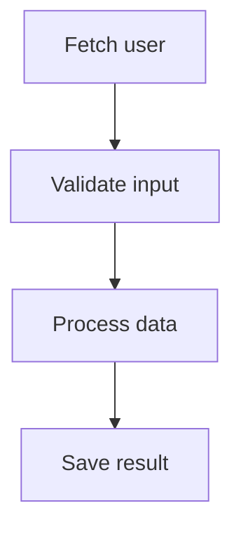
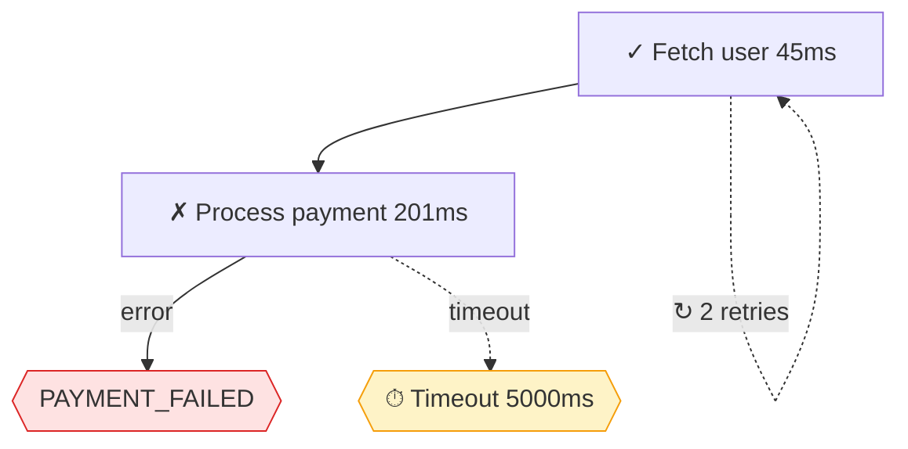

# Workflow Visualization

Tools for seeing what your workflows actually do—ASCII timelines, Mermaid diagrams, live terminal updates, and performance analysis.

## The Problem: Invisible Execution

You have a workflow that does 10 things in parallel, retries some, times out others. Something fails. Where? When? Why?

```typescript
// What happened here?
const result = await workflow(async (step) => {
  const { user, orders, recommendations } = await step.parallel({
    user: () => fetchUser(id),
    orders: () => fetchOrders(id),
    recommendations: () => fetchRecommendations(id),  // Did this timeout?
  });
  // ... more steps
});
// result.ok === false — but which step failed and when?
```

Without visibility, debugging means adding `console.log` everywhere. That's noise.

## The Solution: Event-Driven Visualization

Every workflow emits events. Capture them, then render:

```text
checkout [384ms]
├─ Validate cart ✓ (12ms)
├─ ── parallel ──────────────────
│  ├─ Fetch user ✓ (45ms)
│  ├─ Check inventory ✓ (89ms)
│  └─ Calculate shipping ✓ (67ms)
├─ Process payment ✓ (201ms)
└─ Send confirmation ✓ (23ms)
```

You see structure, timing, and status at a glance.

## Basic Usage

```typescript
import { createWorkflow } from '@jagreehal/workflow';
import { createVisualizer } from '@jagreehal/workflow/visualize';

// Create visualizer
const viz = createVisualizer({ workflowName: 'checkout' });

// Connect to workflow
const workflow = createWorkflow(deps, {
  onEvent: viz.handleEvent,
});

// Run workflow
await workflow(async (step) => {
  await step(() => validateCart(cart), { name: 'Validate cart' });
  await step(() => processPayment(payment), { name: 'Process payment' });
});

// Render result
console.log(viz.render());
```

## Output Formats

### ASCII (Default)

```typescript
console.log(viz.render());
// or
console.log(viz.renderAs('ascii'));
```

```text
my-workflow [523ms]
├─ Fetch user ✓ (45ms)
├─ Validate input ✓ (3ms)
├─ Process data ✓ (312ms)
└─ Save result ✓ (163ms)
```

### Mermaid Diagrams

```typescript
console.log(viz.renderAs('mermaid'));
```



Paste into GitHub, Notion, or any Mermaid-compatible tool.

#### Enhanced Mermaid Edges

Mermaid diagrams now show retry loops, error paths, and timeouts as visual edges (not just labels):



**What the edges show:**

- **Retry loops** (`-.->`) - Self-loop showing how many retries occurred
- **Error paths** (`-->|error|`) - Flow to error node showing the error value
- **Timeout paths** (`-.->|timeout|`) - Dashed edge to timeout node

These are enabled by default. To disable, pass options when rendering:

```typescript
import type { MermaidRenderOptions } from '@jagreehal/workflow/visualize';

const options: MermaidRenderOptions = {
  showTimings: true,
  showKeys: false,
  colors: defaultColorScheme,
  showRetryEdges: false,    // Hide retry self-loops
  showErrorEdges: false,    // Hide error path edges
  showTimeoutEdges: false,  // Hide timeout path edges
};
```

### JSON (IR)

```typescript
console.log(viz.renderAs('json'));
```

Returns the intermediate representation (IR) for custom rendering.

## Event Collector

For post-execution analysis, collect events instead of rendering live:

```typescript
import { createEventCollector } from '@jagreehal/workflow/visualize';

const collector = createEventCollector({ workflowName: 'checkout' });

const workflow = createWorkflow(deps, {
  onEvent: collector.handleEvent,
});

await workflow(async (step) => { /* ... */ });

// Access events
const events = collector.getEvents();

// Render anytime
console.log(collector.visualize());
console.log(collector.visualizeAs('mermaid'));
```

## Visualizer Options

```typescript
const viz = createVisualizer({
  workflowName: 'checkout',    // Name shown in output
  showTimings: true,           // Show duration per step (default: true)
  showKeys: false,             // Show step keys (default: false)
  detectParallel: true,        // Auto-detect parallel execution (default: true)
  colors: {                    // Custom color scheme
    success: '\x1b[32m',
    error: '\x1b[31m',
    pending: '\x1b[33m',
  },
});
```

## Parallel and Race Operations

Parallel operations render as grouped branches:

```typescript
await workflow(async (step) => {
  // Named object form - recommended for better type inference
  const { user, orders, settings } = await step.parallel(
    {
      user: () => fetchUser(id),
      orders: () => fetchOrders(id),
      settings: () => fetchSettings(id),
    },
    { name: 'Fetch all data' }
  );
});
```

```text
checkout [234ms]
├─ ── Fetch all data (parallel) ──
│  ├─ Fetch user ✓ (45ms)
│  ├─ Fetch orders ✓ (89ms)
│  └─ Fetch settings ✓ (67ms)
└─ Continue... ✓ (33ms)
```

## Decision Tracking

Visualize conditional branches with `trackIf` and `trackSwitch`:

```typescript
import { trackIf, trackSwitch } from '@jagreehal/workflow/visualize';

const collector = createEventCollector();

await workflow(async (step) => {
  const user = await step(() => fetchUser(id));

  // Track if/else decisions
  const isPremium = trackIf('premium-check', user.tier === 'premium', {
    emit: collector.handleDecisionEvent,
  });

  if (user.tier === 'premium') {
    isPremium.takeBranch('premium');
    await step(() => applyDiscount(20));
  } else {
    isPremium.takeBranch('standard');
    await step(() => applyDiscount(5));
  }
  isPremium.end();

  // Track switch decisions
  const regionSwitch = trackSwitch('region', user.region, {
    emit: collector.handleDecisionEvent,
  });

  switch (user.region) {
    case 'US':
      regionSwitch.takeBranch('US');
      // ...
      break;
    case 'EU':
      regionSwitch.takeBranch('EU');
      // ...
      break;
  }
  regionSwitch.end();
});

console.log(collector.visualize());
```

```text
checkout [523ms]
├─ Fetch user ✓ (45ms)
├─ ◇ premium-check [premium] ───
│  └─ Apply discount ✓ (3ms)
├─ ◇ region [US] ───────────────
│  └─ Calculate tax ✓ (12ms)
└─ Complete order ✓ (163ms)
```

## Live Visualization

Update the terminal in real-time as steps complete:

```typescript
import { createLiveVisualizer } from '@jagreehal/workflow/visualize';

const live = createLiveVisualizer({
  workflowName: 'checkout',
  clearOnUpdate: true,  // Clear terminal between updates
});

const workflow = createWorkflow(deps, {
  onEvent: live.handleEvent,
});

live.start();  // Begin live updates

await workflow(async (step) => {
  await step(() => slowOperation(), { name: 'Processing...' });
});

live.stop();  // Stop updates, show final state
```

The terminal updates as each step completes—useful for long-running workflows.

## Performance Analysis

Analyze execution patterns across multiple runs:

```typescript
import {
  createPerformanceAnalyzer,
  createEventCollector,
} from '@jagreehal/workflow/visualize';

const analyzer = createPerformanceAnalyzer();

// Collect multiple runs
for (let i = 0; i < 100; i++) {
  const collector = createEventCollector();
  const workflow = createWorkflow(deps, { onEvent: collector.handleEvent });
  await workflow(/* ... */);

  analyzer.addRun({
    events: collector.getEvents(),
    duration: Date.now() - startTime,
    success: true,
  });
}

// Analyze
const slowest = analyzer.getSlowestNodes(5);
const errorProne = analyzer.getErrorProneNodes(5);
const retryProne = analyzer.getRetryProneNodes(5);

console.log('Bottlenecks:', slowest);
console.log('Error hotspots:', errorProne);
console.log('Retry hotspots:', retryProne);

// Get heatmap data for visualization
const heatmap = analyzer.getHeatmap(viz.getIR(), 'duration');
```

## Time-Travel Debugging

Navigate through workflow execution step-by-step:

```typescript
import { createTimeTravelController } from '@jagreehal/workflow/visualize';

// Create controller that receives events directly
const timeTravel = createTimeTravelController();

const workflow = createWorkflow(deps, {
  onEvent: timeTravel.handleEvent,
});

await workflow(/* ... */);

// Navigate
timeTravel.seek(0);           // Jump to start
timeTravel.stepForward();     // Next event
timeTravel.stepBackward();    // Previous event
timeTravel.seek(5);           // Jump to event 5

// Get current IR
const ir = timeTravel.getCurrentIR();

// Get state (includes position info)
const state = timeTravel.getState();
console.log(`Position: ${state.currentIndex}/${state.snapshots.length}`);

// Subscribe to changes
timeTravel.onStateChange((state) => {
  console.log(`Position: ${state.currentIndex}`);
});

// Playback
timeTravel.play(500);         // Play at 500ms intervals
timeTravel.pause();
```

## Best Practices

### DO: Name your steps for readable output

```typescript
// ✓ Clear names
await step(() => fetchUser(id), { name: 'Fetch user profile' });
await step(() => validateCart(cart), { name: 'Validate cart items' });
```

### DON'T: Leave steps unnamed in production workflows

```typescript
// ✗ Anonymous steps are hard to debug
await step(() => fetchUser(id));  // Shows as "step_1"
```

### DO: Use the event collector for tests

```typescript
test('workflow executes steps in order', async () => {
  const collector = createEventCollector();
  const workflow = createWorkflow(deps, { onEvent: collector.handleEvent });

  await workflow(/* ... */);

  const events = collector.getWorkflowEvents();
  expect(events.map(e => e.stepName)).toEqual([
    'Fetch user',
    'Validate input',
    'Process data',
  ]);
});
```

### DO: Track decisions that affect flow

```typescript
// Decisions show WHY a path was taken
const decision = trackIf('can-refund', order.status === 'delivered', {
  emit: collector.handleDecisionEvent,
});
// Visualization shows: ◇ can-refund [true] → Refund branch taken
```

## When NOT to Use This

- **Simple scripts** - If you can fit the logic in your head, logging is fine.
- **Extremely high-volume** - Event collection has overhead. Use sampling in production.
- **Fire-and-forget** - If you never look at the output, don't pay for collection.

## Summary

| Feature | Use Case |
| ------- | -------- |
| `createVisualizer` | Post-execution rendering |
| `createEventCollector` | Collect events for later analysis |
| `createLiveVisualizer` | Real-time terminal updates |
| `createPerformanceAnalyzer` | Multi-run bottleneck analysis |
| `createTimeTravelController` | Step-by-step debugging |
| `trackIf` / `trackSwitch` | Visualize conditional branches |

**The key insight:** Workflows emit events. Capture them, render them. Debugging becomes visual.
