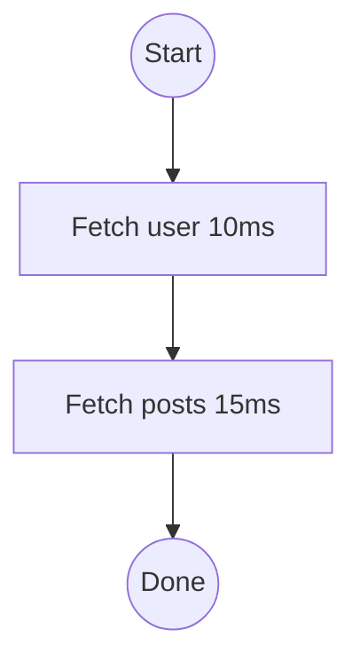

# Visualization Examples

This document provides comprehensive examples of using the `@jagreehal/workflow/visualize` module.

## Basic Usage

### Simple Sequential Workflow

```typescript
import { createVisualizer } from '@jagreehal/workflow/visualize';
import { createWorkflow } from '@jagreehal/workflow';

const viz = createVisualizer({ workflowName: 'User Data Flow' });
const workflow = createWorkflow({ fetchUser, fetchPosts }, {
  onEvent: viz.handleEvent,
});

await workflow(async (step) => {
  const user = await step(() => fetchUser('1'), { name: 'Fetch user' });
  const posts = await step(() => fetchPosts(user.id), { name: 'Fetch posts' });
  return { user, posts };
});

console.log(viz.render());
```

Output:
```
┌── User Data Flow ───────────────────────────────────────────┐
│                                                             │
│  ✓ Fetch user [10ms]                                       │
│  ✓ Fetch posts [15ms]                                      │
│                                                             │
│  Completed in 25ms                                         │
│                                                             │
└─────────────────────────────────────────────────────────────┘
```

## Parallel Operations

### Visualizing Individual Parallel Steps

To see individual steps in parallel operations, wrap each operation with `step()`:

```typescript
const viz = createVisualizer({ workflowName: 'Parallel Fetch' });
const workflow = createWorkflow({ fetchUser, fetchPosts }, {
  onEvent: viz.handleEvent,
});

await workflow(async (step) => {
  // Wrap each operation with step() to track individually
  const [user, posts] = await step.parallel('Fetch all data', async () => {
    const userResult = await step(() => fetchUser('1'), { name: 'Fetch user' });
    const postsResult = await step(() => fetchPosts('1'), { name: 'Fetch posts' });
    return [userResult, postsResult];
  });
  return { user, posts };
});

console.log(viz.render());
```

Output:
```
┌── Parallel Fetch ───────────────────────────────────────────┐
│                                                             │
│  ├┬─ ✓ Fetch all data                                       │
│  │ ├ ✓ Fetch user [10ms]                                   │
│  │ └ ✓ Fetch posts [15ms]                                  │
│  └── [15ms]                                                │
│                                                             │
│  Completed in 15ms                                         │
│                                                             │
└─────────────────────────────────────────────────────────────┘
```

### Without Individual Step Tracking

If you use `allAsync()` directly without wrapping operations:

```typescript
await workflow(async (step) => {
  const [user, posts] = await step.parallel('Fetch all data', () =>
    allAsync([fetchUser('1'), fetchPosts('1')])
  );
  return { user, posts };
});
```

The visualization will show:
```
┌── Parallel Fetch ───────────────────────────────────────────┐
│                                                             │
│  ├┬─ ✓ Fetch all data                                       │
│  │   (operations not individually tracked)                  │
│  │   (wrap each operation with step() to see individual steps)
│  └── [15ms]                                                │
│                                                             │
└─────────────────────────────────────────────────────────────┘
```

## Decision Tracking

### If/Else Decisions

```typescript
import { trackIf } from '@jagreehal/workflow/visualize';

const collector = createEventCollector({ workflowName: 'Role Check' });
const workflow = createWorkflow({ fetchUser, processAdmin, processUser }, {
  onEvent: collector.handleEvent,
});

await workflow(async (step, deps) => {
  const user = await step(() => deps.fetchUser('1'), { name: 'Fetch user' });

  const decision = trackIf('check-role', user.role === 'admin', {
    condition: "user.role === 'admin'",
    value: user.role,
    emit: collector.handleDecisionEvent,
  });

  if (decision.condition) {
    decision.then();
    await step(() => deps.processAdmin(user), { name: 'Process admin' });
  } else {
    decision.else();
    await step(() => deps.processUser(user), { name: 'Process user' });
  }
  decision.end();

  return user;
});

console.log(collector.visualize());
```

### Switch Decisions

```typescript
import { trackSwitch } from '@jagreehal/workflow/visualize';

const decision = trackSwitch('process-by-role', user.role, {
  condition: 'switch(user.role)',
  value: user.role,
  emit: collector.handleDecisionEvent,
});

switch (user.role) {
  case 'admin':
    decision.case('admin', true);
    await step(() => processAdmin(user), { name: 'Process admin' });
    break;
  case 'user':
    decision.case('user', true);
    await step(() => processUser(user), { name: 'Process user' });
    break;
  default:
    decision.default(false);
}
decision.end();
```

## Output Formats

### ASCII (Default)

```typescript
const output = viz.render(); // or viz.renderAs('ascii')
```

Best for:
- Terminal output
- CLI tools
- Logs
- Incident runbooks

### Mermaid

```typescript
const mermaid = viz.renderAs('mermaid');
console.log(mermaid);
```

Best for:
- Markdown documentation
- GitHub README files
- Documentation sites
- PR descriptions

Example Mermaid output:


### JSON

```typescript
const json = viz.renderAs('json');
const ir = JSON.parse(json);
// Programmatically inspect the IR
```

Best for:
- Programmatic analysis
- Custom renderers
- Debugging
- Integration with other tools

## Post-Execution Visualization

Collect events during execution and visualize later:

```typescript
import { createEventCollector } from '@jagreehal/workflow/visualize';

const collector = createEventCollector({ workflowName: 'My Workflow' });
const workflow = createWorkflow(deps, {
  onEvent: collector.handleEvent,
});

await workflow(async (step) => {
  // ... workflow execution
});

// Later, visualize collected events
console.log(collector.visualize());
console.log(collector.visualizeAs('mermaid'));

// Or access raw events
const events = collector.getEvents();
```

## Options

### Customize Display

```typescript
const viz = createVisualizer({
  workflowName: 'My Workflow',
  showTimings: true,      // Show duration for each step
  showKeys: true,         // Show cache keys
  detectParallel: true,   // Auto-detect parallel execution
  colors: {               // Customize colors
    success: '\x1b[32m',
    error: '\x1b[31m',
    // ...
  },
});
```

### Disable Parallel Detection

If you want to see steps in their original order without grouping:

```typescript
const viz = createVisualizer({
  workflowName: 'Sequential View',
  detectParallel: false, // Disable heuristic parallel detection
});
```

## Best Practices

1. **Always provide step names** for better visualization:
   ```typescript
   await step(() => fetchUser(id), { name: 'Fetch user' });
   ```

2. **Use keys for cacheable steps** to enable visualization of cache hits:
   ```typescript
   await step(() => fetchUser(id), { 
     name: 'Fetch user',
     key: `user:${id}` 
   });
   ```

3. **Track decisions explicitly** for conditional logic:
   ```typescript
   const decision = trackIf('check-condition', condition, {
     emit: collector.handleDecisionEvent,
   });
   ```

4. **Wrap parallel operations** with `step()` to see individual steps:
   ```typescript
   await step.parallel('Parallel fetch', async () => {
     const a = await step(() => fetchA(), { name: 'Fetch A' });
     const b = await step(() => fetchB(), { name: 'Fetch B' });
     return [a, b];
   });
   ```

## Troubleshooting

### Empty Parallel/Race Scopes

If you see "(operations not individually tracked)" in parallel/race scopes, wrap each operation with `step()` to track them individually.

### Sequential Steps Grouped as Parallel

If sequential steps are incorrectly grouped as parallel, disable parallel detection:
```typescript
const viz = createVisualizer({ detectParallel: false });
```

Or adjust the parallel detection options:
```typescript
const viz = createVisualizer({
  detectParallel: true,
  parallelDetection: {
    minOverlapMs: 5,  // Require 5ms overlap
    maxGapMs: 0,      // No gap tolerance
  },
});
```

### Mermaid Parse Errors

The Mermaid renderer automatically escapes special characters. If you encounter parse errors, ensure step names and conditions don't contain unescaped brackets, parentheses, or quotes.


